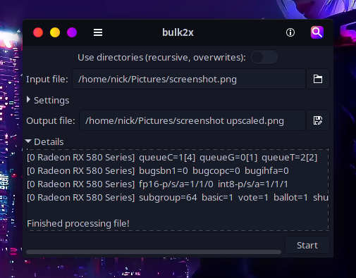

# bulk2x-ncnn-vulkan
Simple GUI to make it easy to use [waifu2x-ncnn-vulkan](https://github.com/nihui/waifu2x-ncnn-vulkan) with individual files and whole directories.

# Obtaining
You can download a compressed archive ([zip](https://gitlab.com/nickgirga/bulk2x-ncnn-vulkan/-/archive/master/bulk2x-ncnn-vulkan-master.zip), [tar.gz](https://gitlab.com/nickgirga/bulk2x-ncnn-vulkan/-/archive/master/bulk2x-ncnn-vulkan-master.tar.gz), [tar.bz2](https://gitlab.com/nickgirga/bulk2x-ncnn-vulkan/-/archive/master/bulk2x-ncnn-vulkan-master.tar.bz2), [tar](https://gitlab.com/nickgirga/bulk2x-ncnn-vulkan/-/archive/master/bulk2x-ncnn-vulkan-master.tar)) of the repository from the [project overview](https://gitlab.com/nickgirga/bulk2x-ncnn-vulkan) or you can clone the repository using git by running `git clone https://gitlab.com/nickgirga/bulk2x-ncnn-vulkan.git`. If you downloaded a compressed archive, decompress it using the appropriate tool (unzip, tar). Then head to the [running](#running) section.

# Running
Simply run `./bulk2x-ncnn-vulkan` in the root directory of the repository. If you do not have [waifu2x-ncnn-vulkan](https://github.com/nihui/waifu2x-ncnn-vulkan) installed, bulk2x-ncnn-vulkan will download [Release 20210210](https://github.com/nihui/waifu2x-ncnn-vulkan/releases/tag/20210210) and unzip it for you.
